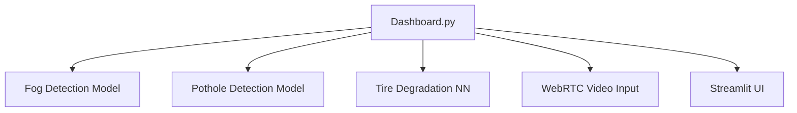

# 🚗 DriveSure: Detect, Predict, Prevent

DriveSure is a smart road safety companion. Harnessing real-time machine learning and robust video analysis, DriveSure alerts you to hazards like fog, potholes, and tire wear—before your journey is at risk. Everything comes together in a single, interactive Streamlit dashboard.

---

## 📚 Table of Contents

1. [Key Features](#key-features)
2. [Architecture Overview](#architecture-overview)
3. [Project Structure](#project-structure)
4. [Installation & Setup](#installation--setup)
5. [Usage Guide](#usage-guide)
6. [Tech Stack](#tech-stack)
7. [Team](#team)
8. [Feedback](#feedback)

---

## 🚀 Key Features

- **Real-time Data Analysis:** Potentially analyzes live video or data streams to identify potential hazards.
- **Fog Detection:** Uses a machine learning model to detect fog conditions.
- **Pothole Detection:** Employs a deep learning model to identify potholes in real-time.
- **Tire Degradation Assessment:** Utilizes a neural network to predict tire degradation levels.
- **Streamlit Dashboard:** Provides a user-friendly interface for visualizing data and interacting with the system.
- **WebRTC Integration:** Allows integration with webcams to obtain video data for analysis.
- **Plug and Play:** Fast setup for instant road safety insights.

---

## 🏗️ Architecture Overview



---

## 📂 Project Structure

```text
DriveSure/
│
├── models/                          # Machine learning models and scalers
│   ├── fog_detection_model.pkl
│   ├── fog_scaler.pkl
│   ├── pothole_model.h5
│   ├── scaler-2.pkl
│   └── tire_degradation_nn_model.h5
│
├── .DS_Store                        # System file (macOS)
├── .gitignore                       # Git ignore rules
├── .python-version                  # Python environment version
├── README.md                        # Project documentation
├── car_animation.json               # Animation asset for dashboard UI
├── dashboard.py                     # Main Streamlit dashboard application
├── requirements.txt                 # Python dependencies
├── tire_predictions.csv             # Reference tire wear data
```

---

## ⚙️ Installation & Setup

1. **Clone the repo**  
    ```
    git clone https://github.com/LaxmiVarshithaCH/DriveSure.git
    cd DriveSure
    ```
2. **Create a Python virtual environment**  
    ```
    python3 -m venv venv
    source venv/bin/activate       # Linux/macOS
    venv\Scripts\activate         # Windows
    ```
3. **Install dependencies**  
    ```
    pip install -r requirements.txt
    ```
4. **Add models and data files**
   
   Place these files in `models/` directory (if not already present):
   - `fog_detection_model.pkl`
       - A supervised classification model that predicts cabin fog conditions using scaled environmental sensor data and triggers an automated defogging control sequence.
   - `fog_scaler.pkl`
   - `pothole_model.h5`
   - `tire_degradation_nn_model.h5`
       - A feedforward neural network trained to predict tire degradation using preprocessed vehicle telemetry and track features.
   - `scaler-2.pkl`
   
   Also, ensure the root directory includes:
   - `car_animation.json`
   - `tire_predictions.csv`

---

## 🚦 Usage Guide

Start the dashboard:
    ```
    streamlit run dashboard.py
    ```
- Dashboard launches in your browser.
- View real-time predictions (fog, pothole, tire).
- Toggle webcam integration for live hazard alerts.
- Explore analytics and visualizations interactively.

---

## 🧰 Tech Stack

- **Python 3.6+**
- **Streamlit** (dashboard UI)
- **TensorFlow / scikit-learn** (ML models)
- **OpenCV** (video analysis)
- **streamlit-webrtc** (webcam integration)
- **numpy, pandas** (data handling)

---

## 👥 Team

<table>
  <tr>
    <td align="center">
      <a href="https://github.com/LaxmiVarshithaCH">
        
        <br />
        <sub><b>Chennupalli Laxmi Varshitha</b></sub>
      </a>
      <br />
    </td>
    <td align="center">
      <a href="https://github.com/2300030861">
        
        <br />
        <sub><b>Dorbala Sai Sujitha</b></sub>
      </a>
      <br />
    </td>
    <td align="center">
      <a href="https://github.com/32732Nikitha">
        
        <br />
        <sub><b>Dorbala Sai Nikitha</b></sub>
      </a>
      <br />
    </td>
      <td align="center">
      <a href="https://github.com/2300030144">
        
        <br />
        <sub><b>Chittelu Nissy</b></sub>
      </a>
      <br />
    </td>
  </tr>
</table>

---

## 📬 Feedback

Have ideas, bug reports, or feature requests?  
- Open an issue or pull request.
- Let's make road safety smarter together! 🚦

---

**DriveSure: Smarter roads. Safer journeys. Every mile.**
